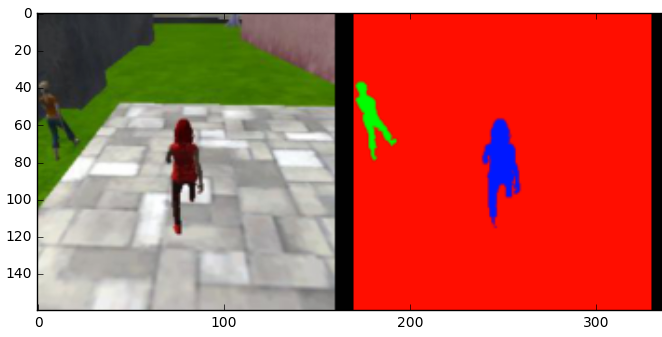
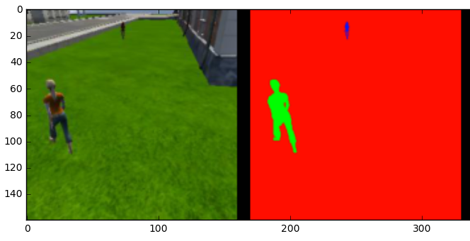
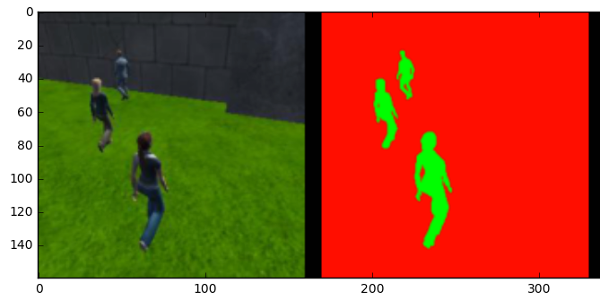
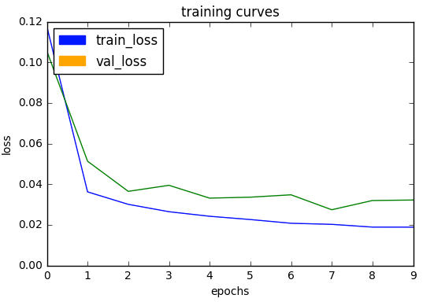

## [Rubric](https://review.udacity.com/#!/rubrics/1155/view)
Here is my writeup for the Udacity RoboND Deep Learning Project.
---

### Results
| Task        			|     Score	        	  | 
|:---------------------:|:-----------------------:| 
| Following Target    	| TP: 539 FP:  0 FN: 0    | 
| Patrol - No Target 	| TP:   0 FP: 92 FN: 0 	  |
| Distant Target     	| TP: 173 FP:  4 FN: 128  |
| Final Score			| 0.448					  |

The model and data achieve an accuracy of 44.8% using the intersection over union metric (IOU).

#### Following Target

#### Patrolling with Target Visible

#### Patrolling without Target

### Network Architecture

| Layer         		|     Description	        					| 
|:---------------------:|:---------------------------------------------:| 
| Input         		| 160x160x3 RGB image   						| 
| 2D Convolution     	| 1x1 stride, kernel 3x3, 32 filters 			|
| 2D Convolution     	| 1x1 stride, kernel 3x3, 32 filters 			|
| Encoder 1    			| 2x2 stride, kernel 3x3, 32 filters 			|
| Encoder 2		     	| 2x2 stride, kernel 3x3, 64 filters 			|
| Encoder 3 			| 2x2 stride, kernel 3x3, 128 filters 			|
| 1x1 Convolution	    | 256 filters, kernel 1x1, 1x1 stride		    |
| Decoder 1	      		| 128 filters, Skip Connection: Encoder 3		|
| Decoder 2	    		| 64 filters, Skip Connection: Enocder 2		|
| Decoder 3	    		| 32 filters, Skip Connection: Input			|
| 2D Convolution		| outputs NUM_CLASSES, activation = softmax		|
 
My architecture is a derivative of the VGG-16 architecture, recommended by the original scene segmentation paper.
Two standard convolutions are applied to the input image to extract features before the encoder/decoder sections of the network.
I selected three encoder-decoder layers to strike a balance between computational cost and model capacity.

[SegNet: A Deep Convolutional Encoder-Decoder Architecture for Image Segmentation](https://arxiv.org/abs/1511.00561.pdf)

### Hyper-Parameters
* Optimizer: Adam
* Learning Rate: 1e-2
* Batch Size: 64
* Number of epochs: 10

The Adam optimizer is standard choice for deep learning applications that reduces the randomness of stochastic gradient descent and improves model convergence. Larger batch sizes converge to sharp minima, so I selected a small batch size as recommend by the paper below. Decreasing the number of training epochs prevents the network from learning completely from the data. Increasing the number of epochs causes overfitting and does not improve network accuracy.

[On Large-Batch Training for Deep Learning: Generalization Gap and Sharp Minima](https://arxiv.org/abs/1609.04836)

### (1x1 Convolution) Vs. Fully-Connected Layer
1x1 Convolutions is preserves spatial information while mapping the input data into a new channel space.
With the scene segmentation, we are interested in assigning each pixel to a specific class, so preserving spatial information is necessary.

The fully-connected layer flattens the spatial information while identifying new features in the data. 
For traditional classification tasks, we assign a class to the entire image. Once a sufficient set of features is extracted from an image, the spatial information is not necessary. Therefore, the fully-connected layer interprets the input as a bag of features without spatial information.

### Encoding / Decoding Images
The Encoder identifies robust features in the image, while the Decoder rebuilds the original image using the encoder features.
The setup is used for machine learning tasks that require the preservation of spatial information or generating images.

* Scene Segmentation - Assign each pixel in an image to a specific class
* Image Super-Resolution - Convert low resolution images to high resolution images.
* Image Generation - Generative Adversarial Networks (GANs) and Variational Auto-Encoders (VAEs) generate new high-quality images using an Encoder / Decoder setup

See [Unsupervised Representation Learning with Deep Convolutional Generative Adversarial Networks](https://arxiv.org/pdf/1511.06434.pdf) for the connections between Encoder/Decoder model and Generative Models.

### Model Limitations
The model architecture and data cannot handle tracking another object. The current architecture is trained to track a specific person, which has different features from other objects. 

More Robust Architecture
* Take a pre-trained network for classification (i.e. VGG-16 - ImageNet)
* Train only the 1x1 convolution and Decoder sections of the network
* Modify the training data to identify multiply types of objects in the scene (i.e. person, dog, cat, car, etc.)
The Encoder section is trained to extract features for a wider range of objects and the training scenario is no longer focused on a single type of object.

### Future Enhancements 
1) Train a more robust architecture that can handle following multiple objects
2) Active Recognition - The quadcopter can move to identify the target from multiple angles.
 * Collect training data from multiple viewpoints
 * Train the quadcopter's behavior to move to obtain a more robust identification using reinforcement learning